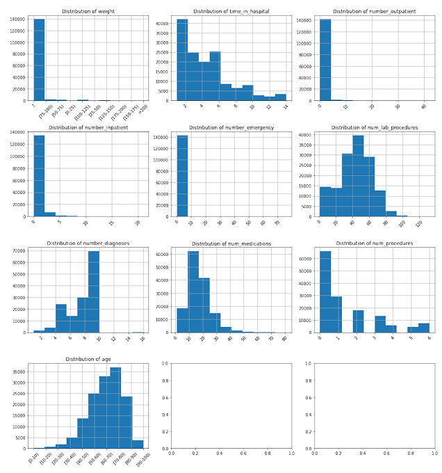
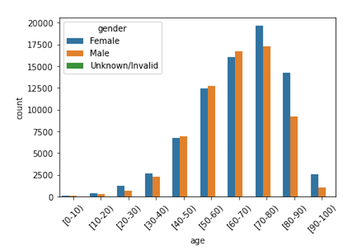
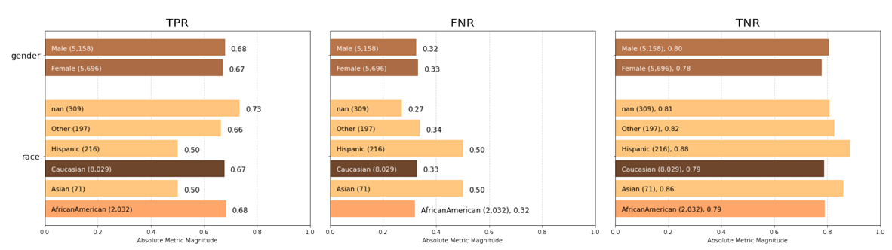

## 🎯 Objective  
Develop a deep learning regression model to predict the expected hospitalization time for patients using electronic health records (EHR) data. The model helps identify ideal candidates for clinical trials of a new diabetes drug that requires extended inpatient monitoring.

## 🧠 Project Overview  
The project builds an end-to-end predictive pipeline using TensorFlow and TensorFlow Probability, integrating categorical and numerical features from EHR datasets. The steps include:
- Data preprocessing and feature engineering with **ICD, CPT, and NDC medical codes**.
- Training a deep learning model with **Bayesian layers** for uncertainty quantification.
- **Bias evaluation** using Aequitas to assess fairness across demographic groups.
- Deploying a classification system that flags patients as eligible or ineligible for clinical trials.

## Clinical Significance  
EHR data offers real-world evidence that informs drug trials and healthcare decisions. Accurately predicting hospitalization duration:
- Optimizes patient selection for resource-intensive treatments.
- Reduces unnecessary costs by targeting the right candidates.
- Ensures ethical and fair inclusion across different demographics.
- Supports regulatory decision-making by validating **trial feasibility**.

## 📦 About the Dataset 
The project utilized a modified version of the UCI Diabetes 130-US hospitals dataset covering years 1999-2008. The dataset was specifically adapted for this course and represents line-level encounter data from diabetes patients.

### Dataset Characteristics:
- **Structure:** Line-level data aggregated to encounter and patient levels
- **Size:** 54,271 unique patient encounters after preprocessing
- **Target variable:** time_in_hospital (continuous variable for regression)
- **Key features:** Demographics, medical codes (ICD, NDC), clinical measurements, and hospital utilization metrics

### Data Schema Overview:
- **Patient identifiers:** encounter_id, patient_nbr
- **Demographics:** race, gender, age (bucketed)
- **Clinical features:** diagnosis codes, lab procedures, medications
- **Utilization metrics:** outpatient/inpatient/emergency visits

## Project Steps

## Exploratory Data Analysis

### Missing Values and Data Quality
- **Weight field:** 97% missing values – Excluded from modeling.
- **Payer_code:** 38% missing values – Retained with imputation.
- **Medical specialty:** 48% missing values.
- **NDC codes:** 16% missing values.

### Feature Distributions
- **Gaussian distributions:**  
  - `num_medications` and `num_lab_procedures` exhibit right-skewed normal distributions.
- **Age distribution:**  
  - Left-skewed with a majority of patients in the 70–80 age group.
- **High zero values:**  
  - `number_outpatient` (84%), `number_inpatient` (67%), `number_emergency` (89%).

### High Cardinality Features
- **NDC codes:** 251 unique medication identifiers.
- **Primary diagnosis codes:** 717 unique ICD codes.
- **Other diagnosis codes:** 749 unique secondary diagnoses.
- **Medical specialty:** 73 distinct specialties.

### Demographic Analysis
- **Gender distribution:**  
  - Female patients: 53%  
  - Male patients: 47%
- **Race distribution:**  
  - Predominantly Caucasian: 75%
  - Followed by African American: 18%
- **Age concentration:**  
  - A significant skew toward older patients (70–80 years).

---

## Feature Selection and Model Training

### Feature Engineering
- **Dimensionality Reduction:**  
  - NDC codes were mapped to generic drug names using a lookup table, reducing unique categories from 251 to 20.
- **Categorical Features (12 selected):**  
  - **Demographics:** `race`, `gender`, `age`.
  - **Clinical:** `primary_diagnosis_code`, `other_diagnosis_codes`, `max_glu_serum`, `A1Cresult`.
  - **Administrative:** `admission_type_id`, `admission_source_id`, `payer_code`, `change`.
  - **Medications:** 20 generic drug name dummy variables.
- **Numerical Features (5 key predictors):**  
  - `number_outpatient`, `num_lab_procedures`, `number_diagnoses`, `num_medications`, `num_procedures`.

### Model Architecture
- **Model Framework:** TensorFlow Sequential API with probabilistic layers.
- **Architecture Components:**  
  - **Input Layer:** Dense feature layer combining categorical embeddings and normalized numerical features.
  - **Hidden Layers:**  
    - Dense layers with 512, 256, and 64 neurons using ReLU activation.
    - Batch normalization and dropout (0.3) for regularization.
  - **Output Layer:**  
    - TensorFlow Probability DenseVariational layer for uncertainty quantification.
    - DistributionLambda layer to output predictions as a Normal distribution.
- **Training Configuration:**  
  - **Optimizer:** RMSprop  
  - **Loss Function:** Mean Squared Error  
  - **Batch Size:** 128  
  - **Early Stopping:** Patience of 40 epochs  
  - **Data Split:** 60%/20%/20% train/validation/test

---

## Model Performance

### Regression Performance
- **Final Training Loss:** 6.31  
- **Final Validation Loss:** 8.47  
- **Training MSE:** 5.50  
- **Validation MSE:** 7.78

### Classification Performance (Patient Selection)
- **Conversion Rule:** Regression predictions converted to binary classification using a threshold (≥5 days hospitalization).
- **Overall Accuracy:** 75%  
- **Weighted F1-score:** 0.75  
- **ROC AUC:** 0.75  
- **Class-Specific Performance:**  
  - **Class 0 (<5 days):**  
    - Precision: 80%  
    - Recall: 79%
  - **Class 1 (≥5 days):**  
    - Precision: 66%  
    - Recall: 67%

### Model Interpretation
- **Precision Focus:**  
  - 80% accuracy for patients predicted to be eligible for shorter hospital stays minimizes false inclusions.
- **Recall Optimization:**  
  - 67% capture rate for patients with ≥5 days stay ensures adequate trial enrollment.
- **Uncertainty Quantification:**  
  - The TensorFlow Probability layers provide confidence intervals for predictions.

---

## Bias Analysis and Fairness Evaluation

### Aequitas Framework Analysis
- **Reference Group:** Caucasian males used as the reference.
- **Gender Bias Assessment:**  
  - **Statistical Parity:** Achieved across gender groups.
  - **Equalized Odds:** No significant disparity in true positive and false negative rates.
  - **Precision Parity:** Balanced performance observed between male and female patients.
- **Racial Bias Assessment:**  
  - African American patients showed slight differences in prediction rates, but these were within acceptable thresholds.
  - Asian and Hispanic patients had limited sample sizes, affecting statistical power.
  - **Overall Assessment:** No evidence of significant racial bias in patient selection.
- **Key Fairness Metrics:**  
  - False Positive Rate Parity, True Positive Rate Parity, and Positive Predictive Value were consistent across demographic groups.

Overall, the comprehensive bias evaluation using the Aequitas toolkit indicates that the model operates with equitable fairness across both gender and racial groups.

